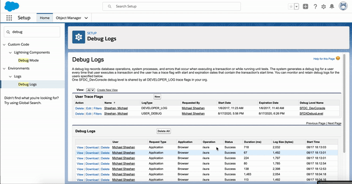

[![Contributors][contributors-shield]][contributors-url]
[![Forks][forks-shield]][forks-url]
[![Stargazers][stars-shield]][stars-url]
[![Issues][issues-shield]][issues-url]
[![MIT License][license-shield]][license-url]
[![LinkedIn][linkedin-shield]][linkedin-url]
# SFDCErrorLogExtractor - (Salesforce Error Log Extractor)

<!-- ABOUT THE PROJECT -->
## About The Project

Program for easily extracting Salesforce error/debug logs and setting debug traceflag for any user within org. 

### Options include:
* enable debug trace logs for any user in an org
* automatically remove debug files to avoid space limitations
* compressing files in zip format so they can be bundled shared
* (Docker) -nginx web server to host files https://docs.docker.com/


<!-- GETTING STARTED -->
## Getting Started

To get a local copy up and running follow these simple steps.

### Software Prerequisites

- [Python3](https://www.python.org/download/releases/3.0/) 
- [SFDX](https://developer.salesforce.com/tools/sfdxcli)
- (optional) [Docker](https://docs.docker.com/)
 
### Setup Prerequisites

Confirm you're authenticated with the Salesforce instance you're extracting the logs. This can be verified by running ```sfdx force:org:list```
 
### Installation

1. Clone the repo
```git clone https://github.com/michael-adam-sheehan/salesforce-errorlog-extractor.git```

#### Docker Installation
2. Run docker-compose and substitute your target org username. (Note: the following command will extract the authenticated url from your credentials tp setup the docker image) ```TARGET_USERNAME="admin@teegrep-dev01.com" && docker-compose build --force-rm --build-arg TARGET_USERNAME=$TARGET_USERNAME --build-arg SFDX_AUTH_URL=$(sfdx force:org:display --verbose -u $TARGET_USERNAME --json | grep "sfdxAuthUrl" | sed -E 's/^.*(force:[^"]+).*$/\1/') web```
3. Start up the container. ```docker-compose up -d```
4. Either login to the container or run the following command to execute the program. ```docker exec -it sfdc-errorlog-extractor python3 -m sfdc_errorlog_extractor -u admin@teegrep-dev01.com -d admin@teegrep-dev01.com --no-traceflag --delete-logs```

#### Non-Docker Install
2. Verify you have Python3 installed. ```python --version```
3. It's recommended to run this within a virtualenv (https://packaging.python.org/guides/installing-using-pip-and-virtual-environments/) but not required. Typical usage would be ```virtual venv && source ./venv/bin/activate```. This creates a subdir called venv for python libs and starts it w/activate.
4. Run program and choose your options. The following command grabs all of the logs from someuser fom the user that authenticated and doesn't set the Trace Debug Flag and removes all logs for this user on theinstance. ```python -m sfdc_errorlog_extractor -u admin@teegrep-dev01.com -d someuser@teegrep-dev01.com --no-traceflag --delete-logs```

<!-- USAGE EXAMPLES -->
## Usage and command options
`errorlog-extraction.py [--no-traceflag --delete-logs --verbose --compress] -u <targetusername> -d <debugusername>`
Required Fields
-u <targetusername> => username you're authenticated with
-d <debugusername> => username you want to extract logs for and set debug trace for if enabled
Optional Fields
--no-traceflag => does not set the debug trace flag for a user. The default is to set the debug traceflag for a user if the traceflag isn't expired.
--delete-logs => removes the users' logs from the instance freeing up the log storage space
--compress => compresses the logs into a zip format

## Video of functionality
Snippet of the program extracting the logs via a Docker container, removing them from the instance and making them available via a nginx web browser.

[](https://www.youtube.com/watch?v=rQ78bRQQDq8)

## Contact

Mike Sheehan- [@twitter_handle](https://twitter.com/schnelg) - michael.adam.sheehan@gmail.com

<!-- MARKDOWN LINKS & IMAGES -->
<!-- https://www.markdownguide.org/basic-syntax/#reference-style-links -->
[contributors-shield]: https://img.shields.io/github/contributors/michael-adam-sheehan/salesforce-errorlog-extractor.svg?style=flat-square
[contributors-url]: https://github.com/michael-adam-sheehan/salesforce-errorlog-extractor/graphs/contributors
[forks-shield]: https://img.shields.io/github/forks/michael-adam-sheehan/salesforce-errorlog-extractor.svg?style=flat-square
[forks-url]: https://github.com/michael-adam-sheehan/salesforce-errorlog-extractor/network/members
[stars-shield]: https://img.shields.io/github/stars/michael-adam-sheehan/salesforce-errorlog-extractor.svg?style=flat-square
[stars-url]: https://github.com/michael-adam-sheehan/salesforce-errorlog-extractor/stargazers
[issues-shield]: https://img.shields.io/github/issues/michael-adam-sheehan/salesforce-errorlog-extractor.svg?style=flat-square
[issues-url]: https://github.com/michael-adam-sheehan/salesforce-errorlog-extractor/issues
[license-shield]: https://img.shields.io/github/license/michael-adam-sheehan/salesforce-errorlog-extractor.svg?style=flat-square
[license-url]: https://github.com/michael-adam-sheehan/salesforce-errorlog-extractor/blob/master/LICENSE.txt
[linkedin-shield]: https://img.shields.io/badge/-LinkedIn-black.svg?style=flat-square&logo=linkedin&colorB=555
[linkedin-url]: https://www.linkedin.com/in/michael-adam-sheehan/
[product-screenshot]: images/screenshot.png
